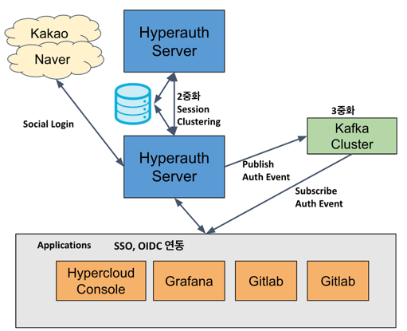
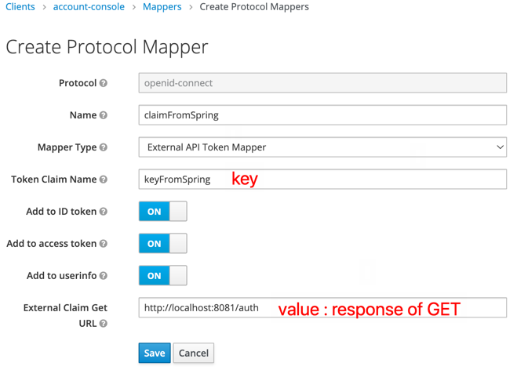
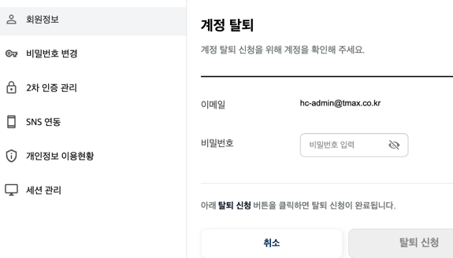
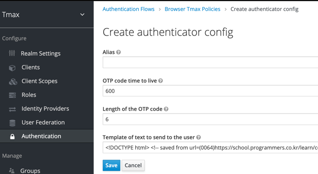
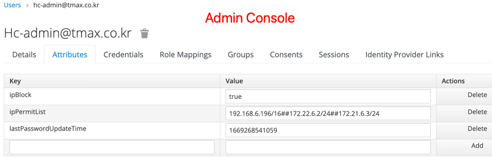
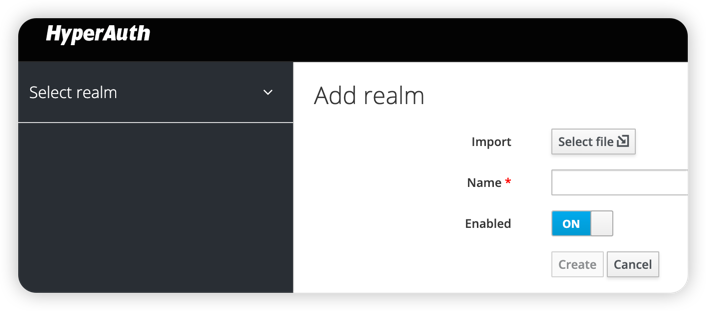
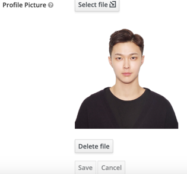

# HyperAuth
- **설치 가이드**
  - 전체 구성
    - Hyperauth 서버 2중화 + RDB (Postgresql or Tibero)
    - Kafka 3중화 + Zookeeper 서버
    - 
  - On Kubernetes 
    - https://github.com/tmax-cloud/install-hyperauth
      - kafka cluster topic server 추가 설치의 경우, Step 4. Kafka Topic Server 설치 만 추가 수행하면 됨
  - On Legacy
    - https://github.com/tmax-cloud/install-hyperauth-legacy
    - Hyperauth-Legacy Tar : 192.168.9.38:/root/hyperauth-legacy-tar 에서 가져오기
      - ex) sftp root@192.168.9.38:/root/hyperauth-legacy-tar/hyperauth-legacy-b1.1.1.28.tar
  - On Docker-compose
    - https://github.com/tmax-cloud/install-hyperauth/blob/main/manifest/docker-compose.yaml

- **운영 및 기능 가이드**  
  - Events Config 관리 
    - 원하는 기능만 사용할 수 있게끔 Plug-In 형식으로 사용 가능
      - 
    - [hyperauth_event_listener](src/main/java/com/tmax/hyperauth/eventlistener/HyperauthEventListenerProvider.java)
      : Realm 에서 발생하는 Event 로그 수집, Tmax 정책에 따른 여러 기능 수행
      - 회원가입 후 10분안에 메일 인증을 안 할시 유저 삭제
      - 비밀번호 변경 시간 관리
    - [duplicate_login_block](src/main/java/com/tmax/hyperauth/eventlistener/DuplicateLoginBlockProvider.java)
      - Client의 유저당 세션을 1개로 유지 하는 기능
    - [kafka_producer](src/main/java/com/tmax/hyperauth/eventlistener/kafka/producer/KafkaEventListenerProvider.java) 
      - Realm의 Event를 Kafka로 Publish 한다.
    - [Prometheus_metric_listener](src/main/java/com/tmax/hyperauth/eventlistener/prometheus/MetricsEventListener.java)
      - Realm의 Event를 Prometheus Metric의 형태로 ( auth/realm/{realmId}/metrics ) 노출
      - Prometheus 설치를 통해 수집 가능 ( Prometheus ServiceMonitor 추가 필요 ) 
      - [수집 Metric 정보](METRICS.md) 참조
    - [Grafana Hyperauth Metrics Json](guide/hyperauth%20metric.json)
      - Grafana Dashboard Import 해서 사용가능
      - 
      
  - Hyperauth 서버 이중화 및 세션 클러스터링 적용
    - Protocol  (Jboss WAS 레벨에서의 세션클러스터링 기능을 활성화 해주는 기능)
      - [KUBE_PING](https://github.com/jgroups-extras/jgroups-kubernetes/blob/master/README.adoc)
    - [설치 Manifest](https://github.com/tmax-cloud/install-hyperauth/blob/main/manifest/2.hyperauth_deployment.yaml) 
      - replica : 2
      - 이중화 관련 Env 추가
      
  - **LOG 수집 가이드**
    - 주의 : hyperauth 이미지 tmaxcloudck/hyperauth:b1.1.0.15부터 적용
      - [설치 yaml](https://github.com/tmax-cloud/install-hyperauth/blob/main/manifest/2.hyperauth_deployment.yaml) 에서 args: ["-c standalone.xml", "-Dkeycloak.profile.feature.docker=enabled -b 0.0.0.0"] 부분 추가해야 사용가능
    - ``` shell
      kubectl exec -it -n hyperauth $(kubectl get pod -n hyperauth | grep hyperauth | cut -d ' ' -f1 | awk 'NR == 1 { print $0; exit }') bash
      cd /opt/jboss/keycloak/standalone/log/hyperauth ```
    - {hyperauth_pod_name}.log 로 실시간 로그가 적재된다.
    - {hyperauth_pod_name}.log.2021-04-21 등으로 하루에 하나씩 로그가 저장된다.
    - hyperauth pod 내부에서 /opt/jboss/keycloak/bin/jboss-cli.sh 를 사용하여서 실시간 로그 설정 변경도 가능하다.
      - [참조](guide/rotational_file_log_command)
      
  - **Token CustomClaim 추가하는 가이드**
    - [Keycloak ProtocolMapper SPI를 활용하여 구현](src/main/java/com/tmax/hyperauth/protocolmapper/ExternalApiMapper.java)
    - External Url API 호출을 통해 Access Token, ID Token, UserProfile에 Claim에 key:value 추가가능
      - 외부 인가에 활용가능
      - Clients 별로 설정을 하기 때문에, 해당 Client로 유저가 로그인을 하는 경우, Claim에 추가 인가 정보 추가
        - 해당 Claim 정보를 통해 인가를 처리하는 부분은 Client Application에서 별도로 구현이 되어야 한다.
      - 
      
  - **Topic Consumer가이드**
    - [Example Consumer](src/main/java/com/tmax/hyperauth/eventlistener/kafka/consumer/EventConsumer.java)
      - TODO 부분 수행
        - Keystore, Truststore 발급, Secret 생성 및 volume mount
        - Password Secret을 이용해서 변수 처리
        - GROUP_ID_CONFIG를 각 hyperauth client name으로 수정
          - group id 별로 topic에 쌓인 데이터를 읽어가는 위치를 나타내는 offset이 달라짐
          - 2 consumer가 한 group id를 공유할 경우, 데이터를 처리하지 못하는 경우 발생
      - [Topic Event 객체](src/main/java/com/tmax/hyperauth/eventlistener/TopicEvent.java)
          ```JSON
          { "type":"LOGIN",
            "userName":"admin@tmax.co.kr",
            "userId":"3c2f0ab5-5c6e-4739-b9db-877ebcfbcd29",
            "time":1610614165834,
            "realmId":"tmax",
            "clientId":"hypercloud4",
            "sessionId":"fe9b95f7-eb51-4504-9110-d2322a9f1bc1",
            "ipAddress":"192.168.6.107",
            "details":{
              "auth_method":"openid-connect",
              "auth_type":"code",
              "redirect_uri":"https://172.22.6.2:31304/?first",
              "consent":"no_consent_required",
              "code_id":"fe9b95f7-eb51-4504-9110-d2322a9f1bc1",
              "username":"admin@tmax.co.kr"}
          }
          ```
      - **Publish 중인 Event Verb (정책에 따라 추가 가능)**
        - [Keycloak Base EventType](guide/keycloak11.0.2_EventType.java)
        - Hyperauth 추가 Event
          - USER_WITHDRAWAL : 유저가 탈퇴 신청을 한 경우
          - USER_WITHDRAWAL_CANCEL : 유저가 탈퇴신청을 철회한 경우
          - USER_DELETE : 탈퇴 신청을 한 유저가 실제로 지워진 경우, Admin Console에서 Admin 권한으로 유저가 삭제된 경우  
    - [Kafka Consumer 개발 공식 가이드](https://cwiki.apache.org/confluence/display/KAFKA/Clients)
      - java 외 다른 언어의 경우 참조할 것.
      - [Golang 가이드(Hypercloud api-server)](https://github.com/tmax-cloud/hypercloud-api-server/blob/main/util/consumer/kafkaConsumer.go)
    - Kafka Topic Event Data Default 보관 기간 : 7일
  
  - [**Fido 기반 생체 인증 기능 사용 가이드**](https://github.com/tmax-cloud/hyperauth/blob/main/guide/hyperauth_fido_guide.pptx)
    - Keycloak WebAuthn Passwordless Policy 참조
    
  - [**비밀번호 변경 3개월 경과시 비밀번호 변경 유도 기능 사용 가이드**](src/main/java/com/tmax/hyperauth/authenticator/passwordUpdateAlert/PasswordUpdateAlertAuthenticator.java)
    - Admin Console 
      - Authentication - Bindings - Brower Flow : **Browser With PasswordUpdateAlert** 선택
      - Config ( Authentication - Browser with Tmax Polices - Password Update Alert - Actions - Config 선택 )
        - Password Update Period in Month : 비밀번호 변경 주기 ( default : 3 )
    - 비밀번호 변경( 한적이 없는 경우, 최초 생성 ) 3개월 경과시, 로그인 시 비밀번호 변경 유도 화면 나타남
    - 다음에 변경하기 클릭시, 다음 로그인 시에 다시 한번 변경 페이지 나타남
    - 과거에 사용하던 비밀번호 사용 불가능
    
  - [**탈퇴 신청 로그인시, 탈퇴 신청 철회 화면 사용 가이드**](src/main/java/com/tmax/hyperauth/authenticator/withdrawalCancel/WithdrawalCancelAuthenticator.java)
    - 탈퇴 신청
      - Account Console(Tmax Theme) - 회원정보 탭에서 유저가 스스로 탈퇴를 신청할수 있음.
      - 탈퇴 신청의 경우 30일간 로그인 제한이 걸리고, 유저는 30일 이내에 언제든 탈퇴 신청 취소를 할수 있다.
      - 30일 경과 시 유저가 완전히 삭제된다.
      - 
    - Admin Console
      - Authentication - Bindings - Brower Flow : **Browser With User Withdrawal Cancel** 선택
    - 탈퇴 취소 버튼 클릭 시, 탈퇴 신청이 취소되고, 정상적으로 서비스 이용가능
  
  - [**EmailOTP 2-factor 인증 기능 사용 가이드**](src/main/java/com/tmax/hyperauth/authenticator/otp/EmailOTPAuthenticator.java)
    - Admin Console
      - Authentication - Bindings - Brower Flow : **Browser with EmailOTP** 선택
      - Config ( Authentication - Browser with Tmax Polices - Mail OTP - Actions - Config 선택 )
        - OTP code time to live : OTP 코드 만료시간 Seconds ( default : 600 )
        - Length of the OTP code : OTP 코드 길이 ( default: 6 )
        - ( Alpha ) Template of text to send to the user : 메일 template
        - 
    - 적용방법
      - 유저가 본인이 적용
        - Account Console (Tmax Theme) - 2차 인증 관리 - OTP 설정
      - Admin이 수동으로 적용
        - OTP 인증을 추가 하고 싶은 user에게 **otpEnable : true** Attribute을 추가
    - id /pw 입력하고 난 후, 메일전송이 완료되면, otp code를 입력하는 화면으로 전환
    
  - [**IP 차단 기능 사용 가이드**](src/main/java/com/tmax/hyperauth/authenticator/securityPolicy/SecurityPolicyAuthenticator.java)
    - Authentication - Bindings - Brower Flow : **Browser with security policy** 선택
    - IP Block 정책을 걸고자 하는 user에게 Attribute을 추가 (Admin이 수동으로 추가 해야함, Keycloak Admin API로 User Attribute을 추가해주어도 가능)
      1. **ipBlock** : true
      2. **ipPermitList** : 192.168.6.196/16##172.22.6.2/24##172.21.6.3/24
      - 

  - [`SecretQuestion 2-factor 인증 기능 사용 가이드`](https://github.com/tmax-cloud/hyperauth/blob/main/src/main/java/com/tmax/hyperauth/authenticator/secretQuestion/SecretQuestionAuthenticator.java) (Alpha)
    - Admin Console
      - Authentication - Bindings - Brower Flow : **Browser with secret question** 선택
      - Authentication - Required Actions : **Secret Question Enabled**, **Default Action**으로 선택하여 질문의 답을 추가하게 강제 
  
- **빌드 및 이미지 정보** 
  - 이미지 Pull
    ```sh
    docker pull tmaxcloudck/hyperauth:latest
    ```
  - [Dockerfile](./Dockerfile)
    - [Keycloak Base Image](https://hub.docker.com/r/keycloak/keycloak)
      - Keycloak 10.0.2 : b1.0.0.0 ~ b1.0.9.29
      - Keycloak 11.0.2 : b1.0.10.0 ~ latest
    - [Github](https://github.com/keycloak/keycloak/tree/11.0.2)
    - Hyperauth Jar Build
      - Java Version : 1.8
      - ```sh
        mvn install:install-file -Dfile=lib/com/tmax/tibero/jdbc/6.0/tibero6-jdbc.jar -DgroupId=com.tmax.tibero -DartifactId=jdbc -Dversion=6.0 -Dpackaging=jar -DgeneratePom=true
        mvn install:install-file -Dfile=lib/com/tmax/hyperauth/server-spi-private/11.0.2/keycloak-server-spi-private-11.0.2.jar -DgroupId=com.tmax.hyperauth -DartifactId=server-spi-private -Dversion=11.0.2 -Dpackaging=jar -DgeneratePom=true
        ```
    - Modified Keycloak Jar
      - keycloak-services-11.0.2.jar [(변경 이력)](https://github.com/tmax-cloud/keycloak-services-11.0.2) 
      - keycloak-server-spi-private-11.0.2.jar [(변경 이력)](https://github.com/tmax-cloud/keycloak-server-spi-private-11.0.2)
      - keycloak-model-jpa-11.0.2.jar
  - [Jenkinsfile](./Jenkinsfile)
    
- **정책** (변경 시 와플 본부와 논의 필요)
  - [정책이 적용된 Realm Import Json](https://github.com/tmax-cloud/install-hyperauth/blob/main/manifest/3.tmax-realm-export.json)
    - 
  - User Attribute Key-Value 값 (공통 및 고정)
    - 현재사용중인 Key
      - **user_name**
      - **ipBlock**
      - **ipPermitList**
      - **isAdmin**
      - **otpEnable**
      - **agreeMailOpt**
      - **agree_ischecked_{client_name}**
      - **agreeAdv{client_name}Opt**
      - **withdrawal_unqualified_{client_name}**  
      - **lastPasswordUpdateTime**
      - **deletionDate**
      - **under_14**
    - USER
      - 사용자의 username은 attribute으로 관리
        - user_name : 한글/영어
        - user_name_ko : 한글
        - user_name_en : 영어
      - 사용자의 나이가 14세 미만인 경우 
        - under_14 : true 
        - 14세 이상인 경우, attribute이 존재하지 않거나 value 값이 true가 아님
      - 탈퇴 신청을 Block 해야하는 유저의 경우
        - withdrawal_unqualified_{client_name} : t
          - ex) withdrawal_unqualified_wapl : t   
    - AGREEMENT
      - Hyperauth(공통)의 선택 약관
        - agreeMailOpt : true / false
      - Client별 최초 로그인시 약관
        - agree_ischecked_{ClientName} : true 
          - ex) agree_ischecked_portal : true / agree_ischecked_hypermeeting : true
      - Client별 수신동의 (선택약관)
        - agree{항목종류}{ClientName}Opt : true/false
          - ex) agreeAdvPortalOpt : true / agreeAdvHyperMeetingOpt : true
  
  - 설계 해야할 **Authentication Flow** ( 여러 정책 및 기능들이 로그인 / SNS로 로그인에 적용될수 있도록 설정 해줘야함 ) 
    - Browser :  Authentication - Bindings - Browser Flow 에서 바꿔줘야한다.
      - 
    - First Broker Login : Identity Providers - First Login Flow 에서 바꿔준다.
      - 
    - Post Login for Broker : Identity Providers - Post Login Flow 에서 선택해준다.
      -       
  
- **API 정보**

  - [API Documentation](/APIDOC.md)

# Feature
- [**Auth Event Kafka Publish 기능**](src/main/java/com/tmax/hyperauth/eventlistener/kafka/producer/KafkaEventListenerProvider.java)
- [**중복 Login 방지 기능**](src/main/java/com/tmax/hyperauth/eventlistener/DuplicateLoginBlockProvider.java)
  - 한 유저의 Client당 로그인 session을 하나만 유지
- **회원 가입 시 Email 인증 기능**
  - [가입 10분 후, 이메일 인증을 수행하지 않은 사용자 정보 삭제](src/main/java/com/tmax/hyperauth/eventlistener/HyperauthEventListenerProvider.java) 

- [**Client 별 약관 CRUD 기능**](src/main/java/com/tmax/hyperauth/rest/AgreementProvider.java)
  - [약관 AGREEMENT 테이블 확장](src/main/java/com/tmax/hyperauth/jpa/Agreement.java)
    - [Hibernate 동적 DDL 생성기능 활용](src/main/resources/META-INF/extend_table.xml)

- **네이버로 로그인, 카카오로 로그인**
  - [카카오로 로그인 가이드](guide/kakako_login_guide.pptx)
  - [소셜로그인 개발](src/main/java/com/tmax/hyperauth/identity/kakao/KakaoIdentityProvider.java) 
    - Keycloak SocialIdentityProvider SPI 구현
    - 구글, 페이스북, 깃헙 등등의 Identity Provider는 기존에 Keycloak 에 추가되어 있음
  - [외부 OIDC Provider 서버 개발](https://github.com/tmax-cloud/external-oidc-provider)
    - 카카오, 네이버 역할을 할수 있는 OIDC Provider 예제 서버 개발 가이드
    - [연동 SPI 개발 예시](src/main/java/com/tmax/hyperauth/identity/initech/InitechIdentityProvider.java)
    
- **회원 탈퇴 신청 기능**
  - 탈퇴 신청 후, 사용자 데이터 30일 유지
    - [30일 이전 로그인시 탈퇴 신청 취소 페이지 등장](src/main/java/com/tmax/hyperauth/authenticator/withdrawalCancel/WithdrawalCancelAuthenticator.java)
    - [30일 이후, Scheduler가 유저 삭제](src/main/java/com/tmax/hyperauth/eventlistener/HyperauthEventListenerProviderFactory.java)
    
- **2-factor 인증 기능**
  - [**EmailOTP 기능**](src/main/java/com/tmax/hyperauth/authenticator/otp/EmailOTPAuthenticator.java)
    - 유효시간, 인증숫자의 개수는 설정으로 변경 가능 (default: 10min, 6자리)
  - **생체 인증** 
    - 개발 완료, 추가 기획 필요
    - Tmax Theme AccontConsole - 2차인증에 선택할수 있게 추가
  - `Secret Question 기능` (Alpha)
    - 질문에 대한 답을 입력하는 추가 인증 기능
    - 현재 질문이 하나로 고정되어 있음
    - What is your mom's first name?
    
- [**IP 차단 기능**](src/main/java/com/tmax/hyperauth/authenticator/securityPolicy/SecurityPolicyAuthenticator.java)
  - 사용자 별 IP 차단 기능 제공
    - WhiteList 기반 관리
    - ipBlock attribute 가 true 일때, ipPermitList의 **IP(CIDR)에 대한 접근 허용**
    - 복수개의 CIDR를 등록시 ##으로 구분해서 추가
    
- [**그룹 관리자 관련 기능**](src/main/java/com/tmax/hyperauth/rest/GroupProvider.java)
  - 그룹 관리자는 그룹에 속해 있어야 하고, attribute으로 isAdmin : {groupName} 을 가지고 있어야 한다.
  - 그룹 하위 사용자들에 대한 CRU 기능
  - 기 사용자를 그룹에 초대하는 기능
  - 그룹에 대한 생성, 그룹 관리자로 승격은 HyperAuth 관리자가 직접 제어
  
- [**사용자 비밀번호 관련 기능**](src/main/java/com/tmax/hyperauth/rest/PasswordProvider.java)
  - 사용자가 자신의 비밀번호 변경 기능 (자신의 Token 필요)
  - 비밀번호 찾기 기능 (인증 코드를 Email으로 발송)
  
- [Admin Console 프로필 사진 기능 추가](src/main/java/com/tmax/hyperauth/rest/PictureProvider.java)
  - 
  - Admin Console Theme : Tmax
  - 프로필 사진을 파일로 관리
  
- [**BCrypt Password Hash 알고리즘 추가**](src/main/java/com/tmax/hyperauth/passwordhash/BCryptPasswordHashProvider.java)
  - keycloak이 기본적으로 제공하는 pbkdf2-sha256 알고리즘 외에 BCrypt 알고리즘을 이용해 password를 hashing 할 수 있게 지원
  - Admin Console
    - Authentication > Password Policy : Add Policy > **Hashing Algorithm : bcrypt** 입력
    - 참고 : pbkdf2-sha256 혹은 Bcrypt hash 알고리즘을 사용한 외부 인증 서버로 부터는 비밀번호 migration을 지원가능
      - DB 레벨에서의 Migration으로 가능

  
